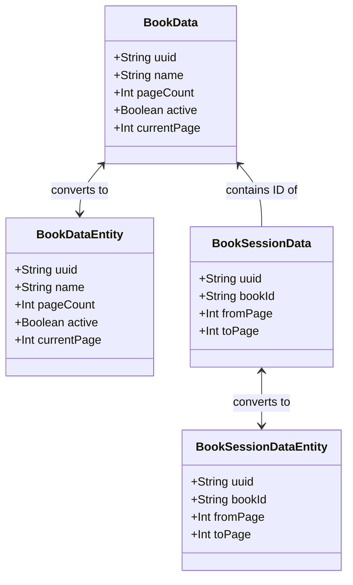

# Data Model

```mermaid
classDiagram

class BookData {
  +String uuid
  +String name
  +Int pageCount
  +Boolean active
  +Int currentPage
}

class BookDataEntity {
  +String uuid
  +String name
  +Int pageCount
  +Boolean active
  +Int currentPage
}

BookData <--> BookDataEntity : converts to
BookData <-- BookSessionData : contains ID of

class BookSessionData {
  +String uuid
  +String bookId
  +Int fromPage
  +Int toPage
}

class BookSessionDataEntity {
  +String uuid
  +String bookId
  +Int fromPage
  +Int toPage
}

BookSessionData <--> BookSessionDataEntity : converts to

```
